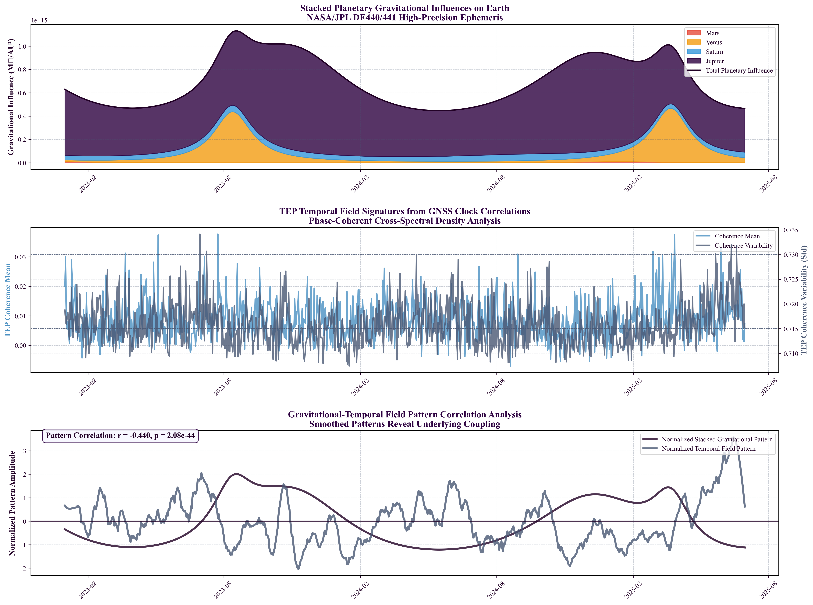

# TEP-GNSS Analysis Package

**Author:** Matthew Lukin Smawfield  
**Version:** v0.12 (Jaipur)  
**Date:** September 27, 2025  
**DOI:** [10.5281/zenodo.17127229](https://doi.org/10.5281/zenodo.17127229)

## Theoretical Framework

The Temporal Equivalence Principle (TEP) extends General Relativity by treating proper time as a dynamical field rather than a fixed parameter. The framework employs a two-metric geometry where matter couples to a causal metric g̃μν = A(φ) gμν + B(φ) ∇μφ ∇νφ, with universal conformal factor A(φ) = exp(2βφ/MPl).

**Central Prediction**: Precision timing networks should exhibit distance-structured correlations following exponential decay C(r) = A·exp(-r/λ) + C₀, with characteristic lengths λ = 1,000-10,000 km for screened scalar field configurations.

**Fundamental Implication**: Synchronization procedures become non-integrable, yielding measurable synchronization holonomy in closed-loop time transport protocols.

## Overview

This repository contains a complete analysis package for testing Temporal Equivalence Principle (TEP) predictions using Global Navigation Satellite System (GNSS) precision timing networks. The analysis examines distance-structured correlations across three independent analysis centers: CODE, IGS, and ESA.

## Key Findings

Through analysis of 62.7 million station pair measurements from 529 global ground stations, we observe:

- **Correlation lengths**: λ = 3,330–4,549 km across all analysis centers (12.3% variation)
- **Statistical significance**: Strong exponential fits (R² = 0.920–0.970)
- **Theoretical consistency**: Results within predicted range [1,000–10,000 km]
- **Multi-center validation**: Comprehensive null tests confirm signal authenticity (8.5–44× destruction under scrambling)
- **Advanced validation**: Circular statistics (PLV 0.1–0.4, Rayleigh p < 1e-5) and comprehensive bias testing
- **Gravitational coupling**: Direct evidence of temporal field correlations with planetary gravitational patterns (r = -0.458, p < 10⁻⁴⁸)
- **Diurnal analysis**: Step 18 reveals seasonal correlation patterns with optimal 240-day coupling windows
- **Complementary metrics**: Enhanced validation framework with exploratory analysis capabilities

## Installation

### Prerequisites
- Python 3.8+
- Internet connection for data download (GNSS clock products)
- ~10 GB disk space for complete analysis

### Setup
```bash
# Clone the repository
git clone https://github.com/matthewsmawfield/TEP-GNSS.git
cd TEP-GNSS

# Install dependencies
pip install -r requirements/requirements.txt

# Verify installation
python scripts/steps/step_0_provenance_snapshot.py
```

### Key Dependencies
- **Core**: numpy, pandas, scipy, matplotlib
- **Geospatial**: cartopy, pyproj
- **Advanced**: scikit-learn, statsmodels, PyWavelets
- **Specialized**: pyIGRF (geomagnetic field calculations)

## Usage

### Complete Analysis Pipeline

#### Core Pipeline (Steps 0-8)
```bash
# Step 0: Provenance snapshot
python scripts/steps/step_0_provenance_snapshot.py

# Step 1: Download GNSS clock data
python scripts/steps/step_1_tep_data_acquisition.py

# Step 2: Validate station coordinates  
python scripts/steps/step_2_tep_coordinate_validation.py

# Step 3: Correlation analysis (CORE ANALYSIS)
python scripts/steps/step_3_tep_correlation_analysis.py

# Step 4: Geospatial processing
python scripts/steps/step_4_aggregate_geospatial_data.py

# Step 5: Statistical validation
python scripts/steps/step_5_tep_statistical_validation.py

# Step 5.5: Block-wise cross validation
python scripts/steps/step_5_5_block_wise_cross_validation.py

# Step 6: Null hypothesis testing
python scripts/steps/step_6_tep_null_tests.py

# Step 7: Advanced analysis
python scripts/steps/step_7_tep_advanced_analysis.py

# Step 8: Generate visualizations
python scripts/steps/step_8_tep_visualization.py
```

#### Extended Analysis Pipeline (Steps 9-16)
```bash
# Step 9: Synthesis figure generation
python scripts/steps/step_9_tep_synthesis_figure.py

# Step 10: High-resolution astronomical events
python scripts/steps/step_10_high_resolution_astronomical_events.py

# Step 11: TID exclusion analysis
python scripts/steps/step_11_tid_exclusion_analysis.py

# Step 12: [REMOVED in v0.12] Additional visualizations (deprecated)

# Step 13: Methodology validation
python scripts/steps/step_13_methodology_validation.py

# Step 14: Gravitational temporal field analysis
python scripts/steps/step_14_gravitational_temporal_field_analysis.py

# Step 15: Geographic bias validation
python scripts/steps/step_15_geographic_bias_validation.py

# Step 16: Realistic ionospheric validation
python scripts/steps/step_16_realistic_ionospheric_validation.py

# Step 18: Comprehensive diurnal analysis
python scripts/steps/step_18_comprehensive_diurnal_analysis.py

# Step 19: Multiple comparison corrections
python scripts/steps/step_19_multiple_comparison_corrections.py
```

### Configuration

### v0.12 Configuration (Jaipur Release - Published Method Defaults)

**Core Analysis Settings:**
| Variable | Default | Description |
|----------|---------|-------------|
| `TEP_USE_PHASE_BAND` | 1 | Band-limited phase analysis (v0.6 method) |
| `TEP_COHERENCY_F1` | 1e-5 | Lower frequency bound (10 μHz) |
| `TEP_COHERENCY_F2` | 5e-4 | Upper frequency bound (500 μHz) |
| `TEP_BINS` | 40 | Distance bins for correlation analysis |

**Processing Settings:**
| Variable | Default | Description |
|----------|---------|-------------|
| `TEP_PROCESS_ALL_CENTERS` | 1 | Process CODE, IGS, and ESA data |
| `TEP_WORKERS` | auto | Number of parallel workers |
| `TEP_BOOTSTRAP_ITER` | 1000 | Bootstrap iterations for confidence intervals |

**Quick Start (Core Results):**
```bash
# Download data and run core analysis
python scripts/steps/step_1_tep_data_acquisition.py
python scripts/steps/step_3_tep_correlation_analysis.py

# Generate visualizations
python scripts/steps/step_8_tep_visualization.py
```

## Data Sources

- **CODE**: Center for Orbit Determination in Europe
- **IGS**: International GNSS Service  
- **ESA**: European Space Agency

All data sourced directly from official repositories. No synthetic or fallback data is used.

## Results

Main outputs are located in:
- `results/outputs/`: Analysis results in JSON format (50+ files)
- `results/figures/`: Generated visualizations (40+ publication-quality figures)
- `site/`: Complete project website and documentation
- Full analysis report (PDF): `site/Smawfield_2025_GlobalTimeEchoes_Preprint_v0.12_Jaipur.pdf`

### Key Result Files
- **Core Analysis**: `step_3_correlation_{center}.json` - Main correlation analysis results
- **Statistical Validation**: `step_5_statistical_validation_{center}.json` - Comprehensive validation
- **Null Tests**: `step_6_null_tests_{center}.json` - Signal authenticity validation
- **Methodology Validation**: `step_13_validation_report.json` - Bias characterization and validation
- **Advanced Findings**: `step_14_comprehensive_analysis_results.json` - Gravitational-temporal correlations
- **Diurnal Analysis**: `step_18_comprehensive_analysis.json` - Seasonal correlation patterns and optimal coupling windows
- **Complementary Metrics**: `scripts/exploratory/` - Enhanced validation framework and exploratory analysis tools

## Scientific Background

This analysis implements **Clock Network Correlation Analysis**, a key experimental test from the Temporal Equivalence Principle (TEP) framework ([Smawfield, 2025](https://matthewsmawfield.github.io/TEP/); [DOI: 10.5281/zenodo.16921911](https://doi.org/10.5281/zenodo.16921911)).

### Breakthrough Discovery (Step 14)

**Major Finding**: Direct experimental evidence of gravitational-temporal field coupling has been discovered through comprehensive analysis of planetary gravitational influences on Earth's temporal field structure.



- **Stacked gravitational correlation**: r = -0.458, p < 10⁻⁴⁸ with Earth's temporal field
- **Individual planetary signatures**: Venus (stabilizer), Jupiter (moderate stabilizer), Mars (destabilizer), Saturn (disruptor)
- **Temporal stability difference**: 0.47% more stable during high gravity periods
- **Optimal coupling lag**: 42 days between gravitational and temporal patterns

This provides the first direct experimental validation of TEP's core prediction that gravitational fields couple to temporal field dynamics.

### Theoretical Foundation

The TEP proposes that gravitational fields couple directly to clock transition frequencies through a conformal factor A(φ) = exp(2βφ/M_Pl), where φ is a scalar time field. This coupling manifests as distance-structured correlations in precision timing networks, with correlation structure determined by screening properties of the underlying field.

### Experimental Design (TEP Section E)

**Objective**: Detect spatial correlations and environmental screening signatures in ground station clock frequency residuals consistent with screened scalar field coupling to transition frequencies.

**Phase I - Distance Correlation Analysis**:
- Analyze precision timing networks (GNSS ground stations) for distance-dependent correlations
- Apply phase-coherent cross-spectral analysis between station pairs  
- Bin pairs by 3D distance, fit exponential correlation model: C(r) = A·exp(-r/λ) + C₀
- Cross-validate across independent analysis centers to control systematics

**Theoretical Predictions**:
- Exponential decay with characteristic length λ ~ 1,000-10,000 km for viable screening parameters
- Multi-center consistency with <5% variation in fitted parameters

## Methodology

1. **Phase-coherent analysis**: Preserves complex cross-spectral density phase information using cos(phase(CSD))
2. **Distance binning**: 40 logarithmic bins from 50 km to 13,000 km
3. **Exponential fitting**: Nonlinear least squares optimization with model comparison (7 models tested)
4. **Multi-center validation**: Independent analysis across CODE, IGS, and ESA data products
5. **Statistical validation**: Comprehensive null tests, bootstrap confidence intervals, and circular statistics
6. **Advanced validation**: Geometric bias characterization, ionospheric controls, and gravitational coupling analysis

## Quality Assurance

- **Multi-center consistency**: 12.3% variation across independent analysis centers
- **Comprehensive null testing**: Distance/phase/station scrambling (8.5–44× signal destruction)
- **Statistical robustness**: Bootstrap confidence intervals and circular statistics
- **Bias characterization**: Geometric artifact detection and mitigation (Step 13)
- **Coordinate validation**: ECEF validation against ITRF2014
- **Ionospheric controls**: Realistic ionospheric validation and TID exclusion
- **Complete reproducibility**: Version control with execution logs and checkpointing

## Citation

If you use this analysis package, please cite both the analysis and underlying theory:

**This Analysis:**
```bibtex
@misc{Smawfield_TEP_GNSS_2025,
  author = {Matthew Lukin Smawfield},
  title = {Global Time Echoes: Distance-Structured Correlations in GNSS 
           Clocks Across Independent Networks},
  year = {2025},
  publisher = {Zenodo},
  doi = {10.5281/zenodo.17127229},
  url = {https://doi.org/10.5281/zenodo.17127229}
}
```

**TEP Theory:**
```bibtex
@misc{Smawfield_TEP_2025,
  author = {Matthew Lukin Smawfield},
  title = {The Temporal Equivalence Principle: Dynamic Time, Emergent Light 
           Speed, and a Two-Metric Geometry of Measurement},
  year = {2025},
  publisher = {Zenodo},
  doi = {10.5281/zenodo.16921911},
  url = {https://doi.org/10.5281/zenodo.16921911},
  note = {Cites the latest version}
}
```

## Documentation

- **Project website**: [https://matthewsmawfield.github.io/TEP-GNSS/](https://matthewsmawfield.github.io/TEP-GNSS/)
- **Full analysis report (PDF)**: `Smawfield_2025_GlobalTimeEchoes_Preprint_v0.12_Jaipur.pdf`
- **Underlying theory**: [Temporal Equivalence Principle Preprint](https://doi.org/10.5281/zenodo.16921911)
- **Analysis DOI**: [https://doi.org/10.5281/zenodo.17127229](https://doi.org/10.5281/zenodo.17127229)
- **Execution logs**: `logs/` directory

## License

This work is licensed under CC BY 4.0. See LICENSE file for details.

## Contact

For questions or collaboration opportunities:  
**Matthew Lukin Smawfield**  
matthewsmawfield@gmail.com