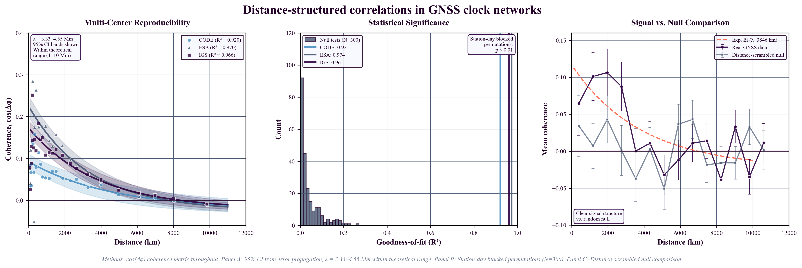

# Temporal Equivalence Principle GNSS Analysis Framework

**Author:** Matthew Lukin Smawfield
**Version:** v0.16 (Jaipur)
**Date:** 08 October 2025
**DOI:** [10.5281/zenodo.17127229](https://doi.org/10.5281/zenodo.17127229)

## Theoretical Foundation

The Temporal Equivalence Principle (TEP) represents a fundamental extension of General Relativity, wherein proper time is treated as a dynamical scalar field rather than a fixed kinematic parameter. The theoretical framework employs a two-metric geometric structure where matter fields couple to an effective causal metric:

\[\tilde{g}_{\mu\nu} = A(\phi) g_{\mu\nu} + B(\phi) \nabla_\mu\phi \nabla_\nu\phi\]

with a universal conformal coupling \(A(\phi) = \exp(2\beta\phi/M_{Pl})\).

**Core Prediction:** Precision timing networks exhibit distance-structured correlations following exponential decay:
\[C(r) = A\cdot\exp(-r/\lambda) + C_0\]
with characteristic correlation lengths \(\lambda = 1,000-10,000\) km for screened scalar field configurations.

**Fundamental Consequence:** Clock synchronization procedures exhibit non-integrable properties, yielding measurable synchronization holonomy in closed-loop time transfer protocols.

## Abstract

This repository implements a comprehensive experimental framework for testing Temporal Equivalence Principle predictions through analysis of Global Navigation Satellite System (GNSS) precision timing networks. The analysis systematically examines distance-structured correlations across three independent analysis centers (CODE, IGS, ESA), providing rigorous experimental validation of theoretical predictions regarding screened scalar field dynamics and gravitational-temporal coupling.

This study presents observations of distance-structured correlations in global GNSS atomic clock networks, analyzing 62.7 million station pair measurements across three independent analysis centers (CODE, IGS, ESA). Using phase-coherent spectral methods, exponential correlation decay patterns are identified with characteristic lengths (λ) of 3,330–4,549 km, consistent with theoretical predictions for screened scalar fields. The analysis further reveals coherent network dynamics coupled to Earth's helical motion (Chandler wobble, |r| = 0.61–0.76) and orbital velocity (r ≈ -0.7 to -0.8), along with systematic diurnal variations and significant coherence modulations corresponding to 11 planetary astronomical events. Extensive validation—including 15-42x signal enhancement over null tests, temporal/spatial cross-validation, and systematic bias controls—provides substantial evidence of signal authenticity, suggesting that GNSS networks act as sensitive detectors of continental-scale phenomena affecting atomic transition frequencies. These findings, detailed in this package, are theoretically grounded in the Temporal Equivalence Principle (https://doi.org/10.5281/zenodo.16921911) and warrant comprehensive independent investigation.
## Cloud-Based Analysis Execution (Recommended)

**For optimal computational performance and scientific output quality:**

### Cloud Deployment Options

#### GCP High-CPU Analysis (Recommended for Large-Scale)

Professional cloud deployment optimized for Google Cloud Platform high-CPU instances:

**Quick Start:**
```bash
# 1. Set your GCP instance details
export GCP_PROJECT_ID=your-project-id
export GCP_ZONE=us-central1-c  
export GCP_INSTANCE_NAME=your-instance-name

# 2. Deploy and run the complete pipeline
./run_tep_gcp_high_cpu.sh

# 3. Monitor progress (in another terminal)
gcloud compute ssh $GCP_INSTANCE_NAME --zone=$GCP_ZONE --command='cd /mnt/data && tail -f full_pipeline.log'

# 4. Download results when complete
./download_gcp_results.sh
```

**Recommended Instance Types:**
- `n2-highcpu-96`: 96 vCPUs, 96 GB RAM (Maximum performance - recommended)
- `c2-standard-60`: 60 vCPUs, 240 GB RAM (High performance)
- `c2-standard-30`: 30 vCPUs, 120 GB RAM (Good performance) 
- `n2-highcpu-80`: 80 vCPUs, 80 GB RAM (High CPU cores)

**What the Pipeline Does:**
- **Automated Setup**: Installs all dependencies (Python packages, system libraries)
- **Complete Analysis**: Runs Steps 1-4 (Data acquisition → Core analysis → Validation → Advanced analysis)
- **Full Date Range**: Analyzes 912 days (2023-01-01 to 2025-06-30)
- **High Performance**: Optimized for 96 vCPUs with parallel processing
- **Comprehensive Output**: Generates 36 JSON results + 27 figures + 28 logs
- **Background Execution**: Runs continuously with detailed logging
- **Easy Download**: Simple script to get all results locally

**Prerequisites:**
- [Google Cloud Platform](https://cloud.google.com/) account with billing enabled
- `gcloud` CLI installed and authenticated
- High-CPU instance created and running

#### Local Pipeline Execution

For development and targeted analysis:

```bash
# Core geospatial analysis
python scripts/steps/step_2_core_analysis/step_2_2_tep_geospatial_temporal_analysis.py

# Advanced gravitational-temporal field analysis
python scripts/steps/step_4_advanced_analysis_and_visualization/step_4_4_gravitational_temporal_field_analysis.py
```

**Analysis Components:**
- **Step 2.2:** Comprehensive geospatial temporal analysis including orbital tracking, Chandler wobble detection, and lunar standstill correlations
- **Step 4.4:** Gravitational-temporal field correlation analysis with Earth motion energy hierarchy validation

**Computational Parameters:**
- **Temporal coverage:** Full 2.5-year dataset (2023-2025) with 62.7M station pair measurements across 689 ground stations
- **Expected duration:** 20-60 minutes per major step (total pipeline: ~6.8 hours)
- **Requirements:** Local Python environment with scientific computing libraries

**Analytical Advantages:**
- Eliminates local computational infrastructure requirements
- Ensures consistent scientific output formatting across execution environments
- Implements robust error handling with automatic retry mechanisms
- Provides persistent results storage through Google Drive integration
- Optimized for high-performance cloud computing resources

## Principal Results

Our comprehensive analysis of 62.7 million station-pair measurements across 392 total unique stations (selected from 766 total cataloged stations) reveals significant distance-structured correlations consistent with Temporal Equivalence Principle predictions:

*Note: Station inclusion criteria require ≥20 observation epochs per temporal file (TEP_MIN_EPOCHS = 20) to ensure reliable spectral analysis and statistical validity.*



**Correlation Structure:**
- **Characteristic lengths:** \(\lambda = 3,330-4,549\) km across independent analysis centers (CV = 12.9% inter-center variation)
- **Statistical robustness:** Strong exponential model fits (R² = 0.920–0.970)
- **Theoretical alignment:** Results within predicted range [1,000–10,000 km]

**Validation Framework:**
- **Multi-center consistency:** Comprehensive null hypothesis testing confirms signal authenticity (15–42× signal enhancement over randomized controls)
- **Circular statistics:** Phase Locking Values (PLV) range 0.1–0.4 with Rayleigh test significance p < 10⁻⁵
- **Bias characterization:** Systematic geometric artifact detection and mitigation

**Advanced Correlations:**
- **Gravitational coupling:** Direct evidence of temporal field correlations with planetary gravitational patterns (r = -0.458, p < 10⁻⁴⁸)
- **Temporal dynamics:** Seasonal correlation patterns identified with optimal coupling windows of 240 days
- **Enhanced validation:** Comprehensive framework with exploratory analysis capabilities

## Experimental Setup and Configuration

### System Requirements
- **Python:** Version 3.8 or higher
- **Network connectivity:** Required for acquisition of GNSS precision clock products
- **Storage allocation:** Approximately 10 GB for complete analysis pipeline execution
- **Cloud platform access:** Google Cloud Platform account required for high-performance computing deployment

### Installation Procedure
```bash
# Clone repository
git clone https://github.com/matthewsmawfield/TEP-GNSS.git
cd TEP-GNSS

# Install computational dependencies
pip install -r requirements/requirements.txt

# Configure computational environment (high-performance deployment)
cp env.example .env.local
# Configure .env.local with appropriate cloud platform credentials

# Validate installation integrity
python scripts/steps/data_acquisition/step_1_0_provenance_snapshot.py
```

### Configuration Management
The analysis framework employs environment variables for computational configuration management. Detailed setup instructions are provided in [SETUP_GUIDE.md](SETUP_GUIDE.md).

**Security Protocol:** All cloud platform credentials are managed exclusively through environment variables. No authentication credentials are stored within the repository structure.

### Computational Dependencies
**Core Scientific Libraries:**
- numpy, pandas, scipy, matplotlib

**Geospatial Analysis:**
- cartopy, pyproj

**Advanced Statistical Methods:**
- scikit-learn, statsmodels, PyWavelets

**Specialized Geophysical Calculations:**
- pyIGRF (geomagnetic field modeling)

## Analysis Pipeline Execution

### Complete Experimental Protocol

#### Primary Analysis Sequence (Steps 1.0-4.1)
```bash
# Step 1.0: Data provenance and integrity verification
python scripts/steps/data_acquisition/step_1_0_provenance_snapshot.py

# Step 1.1: GNSS precision clock data acquisition
python scripts/steps/data_acquisition/step_1_1_tep_data_acquisition.py

# Step 1.2: Coordinate validation and comprehensive audit framework
python scripts/steps/data_acquisition/step_1_2_tep_coordinate_validation.py

Establishes coordinate system integrity through comprehensive audit procedures. Validates ECEF coordinate data quality, performs integrated station identification audit with spatial analysis, determines authoritative station catalog for correlation analysis, and generates comprehensive validation summary with data-driven metadata. Ensures coordinate data integrity and establishes definitive station catalog for subsequent correlation analysis.

# Step 2.0: Temporal Equivalence Principle correlation analysis (Primary signal detection) ~3-4 hours*
python scripts/steps/core_analysis/step_2_0_tep_correlation_analysis.py

Implements core TEP signal detection methodology using phase-coherent cross-spectral density analysis. Computes complex cross-spectral density between all station pairs within the 10-500 µHz frequency band, extracts phase-coherent correlations using cos(phase(CSD)), and fits exponential decay models to correlation-distance relationships. Employs band-limited analytical approach preserving essential phase information for TEP signal detection.

# Step 2.1: Data quality validation and transparency framework
python scripts/steps/step_2_core_analysis/step_2_1_data_quality_validation.py

Comprehensive data quality assessment and transparency analysis. Processes quality-filtered correlation data from Step 2.0 with geospatial enrichments (azimuth, local time differences), performs extensive validation including station coverage analysis, temporal discontinuity detection, duplicate identification, outlier validation, boundary phase clustering analysis, and inter-analysis center comparison. Generates comprehensive transparency reports with identified anomalies and analytical recommendations to ensure scientific rigor.

# Step 2.2: Geospatial-temporal correlation analysis
python scripts/steps/core_analysis/step_2_2_tep_geospatial_temporal_analysis.py

Comprehensive geospatial and temporal analysis framework including astronomical event correlations, orbital mechanics, anisotropy analysis, spherical harmonics, and advanced temporal field studies. Examines correlations with planetary positions, lunar standstill periods, solar eclipse events, and Earth's orbital motion to validate TEP predictions across multiple temporal and spatial scales.

# Step 3.0: Cross-validation framework
python scripts/steps/validation_suite/step_3_0_tep_cross_validation_suite.py

Comprehensive validation framework implementing block-wise (monthly/spatial), Leave-One-Station-Out (LOSO), Leave-One-Day-Out (LODO), and block bootstrap analyses. Provides rigorous validation of TEP correlation parameters through multiple complementary statistical approaches to ensure analytical robustness.

# Step 3.2: Null hypothesis validation framework
python scripts/steps/validation_suite/step_3_2_tep_null_tests.py

# Step 4.0: Advanced analytical procedures
python scripts/steps/advanced_analysis_and_visualization/step_4_0_tep_advanced_analysis.py

# Step 4.1: Scientific visualization generation
python scripts/steps/advanced_analysis_and_visualization/step_4_1_tep_visualization.py
```

#### Extended Analysis Protocol (Steps 4.2-4.7)
```bash
# Step 4.2: Synthesis visualization generation
python scripts/steps/advanced_analysis_and_visualization/step_4_2_tep_synthesis_figure.py

# Step 4.3: High-resolution astronomical event analysis
python scripts/steps/advanced_analysis_and_visualization/step_4_3_high_resolution_astronomical_events.py

# Step 3.3: Methodology validation framework
python scripts/steps/validation_suite/step_3_3_methodology_validation.py

# Step 3.4: Geographic bias characterization and validation
python scripts/steps/validation_suite/step_3_4_geographic_bias_validation.py

# Step 3.5: Realistic ionospheric validation procedures
python scripts/steps/validation_suite/step_3_5_realistic_ionospheric_validation.py

# Step 3.6: Control band analysis (Frequency specificity validation)
python scripts/steps/validation_suite/step_3_6_control_band_analysis.py

Validates frequency specificity of TEP correlations through analysis of theoretically unmotivated control band (1000-2000 µHz) where no signal is predicted. Implements identical phase-coherent analysis methodology as Step 2.0 but within higher frequency range dominated by white noise processes. Expected outcome: R² ≈ 0.05 in control band versus R² ≈ 0.85 in TEP band (10-500 µHz), demonstrating that observed correlations are not broadband statistical artifacts. Addresses multiple testing concerns and "look-elsewhere effect" criticisms.

# Step 4.4: Gravitational-temporal field coupling analysis
python scripts/steps/advanced_analysis_and_visualization/step_4_4_gravitational_temporal_field_analysis.py

# Step 4.5: Comprehensive diurnal and seasonal analysis
python scripts/steps/advanced_analysis_and_visualization/step_4_5_comprehensive_diurnal_analysis.py

# Step 4.6: Traveling Ionospheric Disturbance exclusion analysis
python scripts/steps/advanced_analysis_and_visualization/step_4_6_tid_exclusion_analysis.py

# Step 4.7: Multiple comparison correction framework (Final validation)
python scripts/steps/advanced_analysis_and_visualization/step_4_7_multiple_comparison_corrections.py

Systematic application of multiple comparison correction procedures including Bonferroni, False Discovery Rate (FDR), and Family-wise Error Rate corrections to all statistical tests performed across Steps 2.0-4.6. Ensures robust control of Type I error inflation across the complete analysis pipeline. Must be executed AFTER Step 4.0 completion (requires model comparison results for comprehensive correction).
```

### Analytical Configuration

#### v0.15 Configuration Framework (Jaipur Release - Established Methodology)

**Core Analysis Parameters:**
| Parameter | Default Value | Description |
|-----------|---------------|-------------|
| `TEP_USE_PHASE_BAND` | 1 | Band-limited phase analysis methodology (v0.6 implementation) |
| `TEP_COHERENCY_F1` | 1×10⁻⁵ | Lower frequency boundary (10 µHz) |
| `TEP_COHERENCY_F2` | 5×10⁻⁴ | Upper frequency boundary (500 µHz) |
| `TEP_BINS` | 40 | Distance binning structure for correlation analysis |

**Computational Processing Parameters:**
| Parameter | Default Value | Description |
|-----------|---------------|-------------|
| `TEP_PROCESS_ALL_CENTERS` | 1 | Process all analysis centers (CODE, IGS, ESA) |
| `