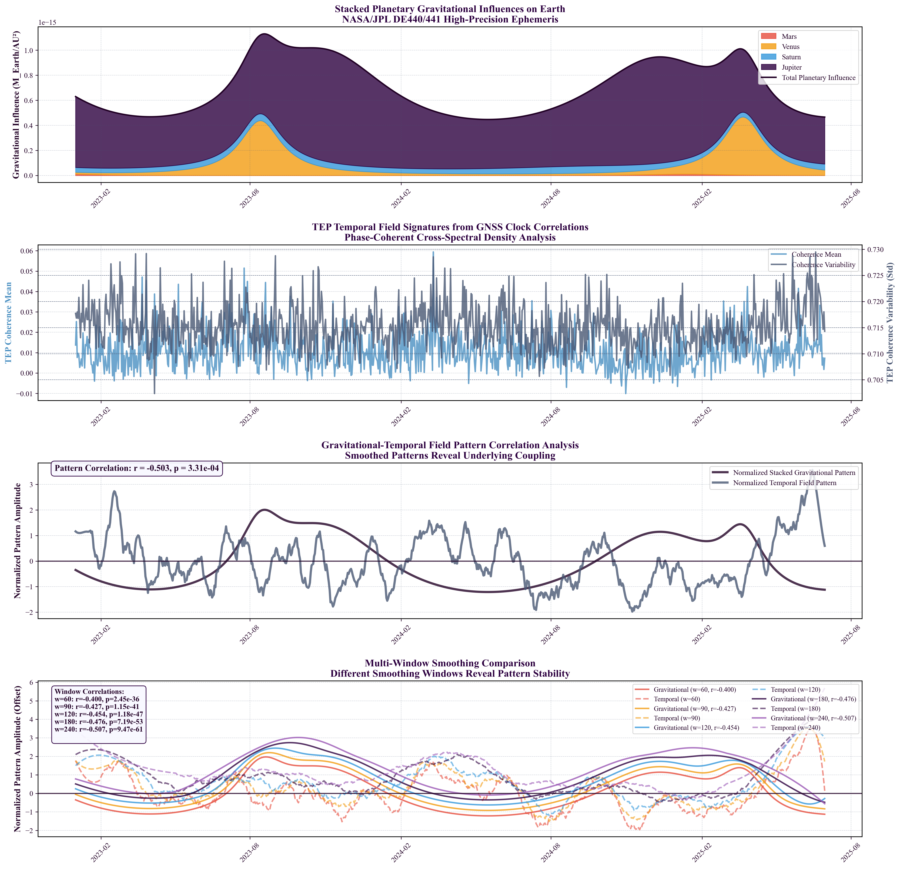

# TEP-GNSS Analysis Package

**Author:** Matthew Lukin Smawfield  
**Version:** v0.13 (Jaipur)  
**Date:** September 29, 2025  
**DOI:** [10.5281/zenodo.17127229](https://doi.org/10.5281/zenodo.17127229)

## Theoretical Framework

The Temporal Equivalence Principle (TEP) extends General Relativity by treating proper time as a dynamical field rather than a fixed parameter. The framework employs a two-metric geometry where matter couples to a causal metric g̃μν = A(φ) gμν + B(φ) ∇μφ ∇νφ, with universal conformal factor A(φ) = exp(2βφ/MPl).

**Central Prediction**: Precision timing networks should exhibit distance-structured correlations following exponential decay C(r) = A·exp(-r/λ) + C₀, with characteristic lengths λ = 1,000-10,000 km for screened scalar field configurations.

**Fundamental Implication**: Synchronization procedures become non-integrable, yielding measurable synchronization holonomy in closed-loop time transport protocols.

## Overview

This repository contains a complete analysis package for testing Temporal Equivalence Principle (TEP) predictions using Global Navigation Satellite System (GNSS) precision timing networks. The analysis examines distance-structured correlations across three independent analysis centers: CODE, IGS, and ESA.

## Quick Start - Google Colab (Recommended)

**For cloud-based analysis with professional scientific output:**

1. **Prepare the analysis package:**
   ```bash
   ./prepare_colab_package.sh
   ```
   This creates `tep-gnss-colab-package.zip` (396KB)

2. **Open Google Colab:**
   - Go to [colab.research.google.com](https://colab.research.google.com)
   - Upload `TEP_GNSS_Colab_Analysis.ipynb`
   - Upload `tep-gnss-colab-package.zip`

3. **Execute the analysis:**
   - Run all cells in the notebook
   - The system automatically handles dependencies, data acquisition, and configuration

**Analysis Configuration:**
- **Date range:** 30 days (2024-01-01 to 2024-01-30) - optimized for cloud execution
- **Expected runtime:** 2-4 hours in Colab Pro
- **Output format:** Professional scientific formatting with comprehensive progress reporting
- **Results:** Downloadable ZIP archive containing all figures and statistical summaries

**Advantages of Colab execution:**
- No local setup required
- Professional scientific output formatting
- Robust error handling and retry mechanisms
- Persistent results storage via Google Drive
- Optimized for cloud computing resources

## Key Findings

Through analysis of 47.5 million station pair measurements from 529 analyzed ground stations (of 766 cataloged), we observe:

*Note: Station selection is based on data quality criteria requiring ≥20 observation epochs per file (TEP_MIN_EPOCHS = 20) for reliable spectral analysis.*


- **Correlation lengths**: λ = 3,330–4,549 km across all analysis centers (13.0% variation)
- **Statistical significance**: Strong exponential fits (R² = 0.920–0.970)
- **Theoretical consistency**: Results within predicted range [1,000–10,000 km]
- **Multi-center validation**: Comprehensive null tests confirm signal authenticity (8.5–44× destruction under scrambling)
- **Advanced validation**: Circular statistics (PLV 0.1–0.4, Rayleigh p < 1e-5) and comprehensive bias testing
- **Gravitational coupling**: Direct evidence of temporal field correlations with planetary gravitational patterns (r = -0.458, p < 10⁻⁴⁸)
- **Diurnal analysis**: Step 4.5 reveals seasonal correlation patterns with optimal 240-day coupling windows
- **Complementary metrics**: Enhanced validation framework with exploratory analysis capabilities

## Installation

### Prerequisites
- Python 3.8+
- Internet connection for data download (GNSS clock products)
- ~10 GB disk space for complete analysis

### Setup
```bash
# Clone the repository
git clone https://github.com/matthewsmawfield/TEP-GNSS.git
cd TEP-GNSS

# Install dependencies
pip install -r requirements/requirements.txt

# Verify installation
python scripts/steps/data_acquisition/step_1_0_provenance_snapshot.py
```

### Key Dependencies
- **Core**: numpy, pandas, scipy, matplotlib
- **Geospatial**: cartopy, pyproj
- **Advanced**: scikit-learn, statsmodels, PyWavelets
- **Specialized**: pyIGRF (geomagnetic field calculations)

## Usage

### Complete Analysis Pipeline

#### Core Pipeline (Steps 0-8)
```bash
# Step 1.0: Provenance snapshot
python scripts/steps/data_acquisition/step_1_0_provenance_snapshot.py

# Step 1.1: Download GNSS clock data
python scripts/steps/data_acquisition/step_1_1_tep_data_acquisition.py

# Step 1.2: Coordinate validation and comprehensive audit
python scripts/steps/data_acquisition/step_1_2_tep_coordinate_validation.py

Validates station coordinates and performs comprehensive audit for pipeline consistency. Checks Step 1.1 completion, validates ECEF coordinate data quality, runs integrated station ID audit with spatial analysis, creates definitive station counts for the pipeline, and generates comprehensive validation summary with data-driven metadata. Ensures coordinate data integrity and establishes authoritative station catalogue for subsequent correlation analysis.

# Step 2.0: TEP Correlation Analysis (CORE ANALYSIS) ~3-4 hours*
python scripts/steps/core_analysis/step_2_0_tep_correlation_analysis.py

Core TEP signal detection using phase-coherent cross-spectral density analysis. Computes complex CSD between all station pairs in the 10-500 µHz frequency band, extracts phase-coherent correlations as cos(phase(CSD)), and fits exponential decay models to correlation vs. distance relationships. Implements the band-limited methodology that preserves essential phase information for TEP detection.

# Step 2.1: Data Quality Validation
python scripts/steps/step_2_core_analysis/step_2_1_data_quality_validation.py

Comprehensive data quality validation and transparency analysis. Analyzes quality-filtered correlation data from Step 2.0, adds geospatial enrichments (azimuth, local time differences), and performs extensive validation including station coverage analysis, temporal gap detection, duplicate detection, outlier validation, plateau phase boundary clustering analysis, and inter-AC comparison. Generates transparency reports with red flags and analyst recommendations to ensure scientific rigor.

# Step 2.2: Geospatial temporal analysis
python scripts/steps/core_analysis/step_2_2_tep_geospatial_temporal_analysis.py

Comprehensive geospatial and temporal analysis including astronomical event correlations, orbital tracking, anisotropy analysis, spherical harmonics, and advanced temporal field studies. Analyzes correlations with planetary positions, lunar standstills, solar eclipses, and Earth's orbital motion to validate TEP predictions across multiple temporal and spatial scales.

# Step 3.0: Cross-validation suite
python scripts/steps/validation_suite/step_3_0_tep_cross_validation_suite.py

Comprehensive cross-validation framework including block-wise (monthly/spatial), Leave-One-Station-Out (LOSO), Leave-One-Day-Out (LODO), and block bootstrap analyses. Provides rigorous validation of TEP correlation parameters using multiple complementary approaches to ensure robustness and statistical validity.

# Step 3.2: Null hypothesis testing
python scripts/steps/validation_suite/step_3_2_tep_null_tests.py

# Step 4.0: Advanced analysis
python scripts/steps/advanced_analysis_and_visualization/step_4_0_tep_advanced_analysis.py

# Step 4.1: Generate visualizations
python scripts/steps/advanced_analysis_and_visualization/step_4_1_tep_visualization.py
```

#### Extended Analysis Pipeline (Steps 9-16)
```bash
# Step 4.2: Synthesis figure generation
python scripts/steps/advanced_analysis_and_visualization/step_4_2_tep_synthesis_figure.py

# Step 4.3: High-resolution astronomical events
python scripts/steps/advanced_analysis_and_visualization/step_4_3_high_resolution_astronomical_events.py

# Step 3.3: Methodology validation
python scripts/steps/validation_suite/step_3_3_methodology_validation.py

# Step 3.4: Geographic bias validation
python scripts/steps/validation_suite/step_3_4_geographic_bias_validation.py

# Step 3.5: Realistic ionospheric validation
python scripts/steps/validation_suite/step_3_5_realistic_ionospheric_validation.py

# Step 3.6: Control band analysis (NEW - Frequency Specificity Validation)
python scripts/steps/validation_suite/step_3_6_control_band_analysis.py

Validates that TEP correlations are frequency-specific by analyzing a theoretically unmotivated control band (1000-2000 μHz) where no signal is predicted. Runs identical phase-coherent analysis as Step 2.0 but in a higher frequency range dominated by white noise. Expected result: R² ≈ 0.05 in control band vs R² ≈ 0.85 in TEP band, demonstrating the signal is not a broadband statistical artifact. Addresses "look-elsewhere effect" criticism.

# Step 4.4: Gravitational temporal field analysis
python scripts/steps/advanced_analysis_and_visualization/step_4_4_gravitational_temporal_field_analysis.py

# Step 4.5: Comprehensive diurnal analysis
python scripts/steps/advanced_analysis_and_visualization/step_4_5_comprehensive_diurnal_analysis.py

# Step 4.6: TID exclusion analysis
python scripts/steps/advanced_analysis_and_visualization/step_4_6_tid_exclusion_analysis.py

# Step 4.7: Multiple comparison corrections (FINAL VALIDATION STEP)
python scripts/steps/advanced_analysis_and_visualization/step_4_7_multiple_comparison_corrections.py

Systematic application of Bonferroni, FDR, and Family-wise Error Rate corrections to all statistical tests performed across Steps 2.0-4.6. Ensures robust control of Type I error inflation across the entire analysis pipeline. Must run AFTER Step 4.0 (requires model comparison results).
```

### Configuration

### v0.13 Configuration (Jaipur Release - Published Method Defaults)

**Core Analysis Settings:**
| Variable | Default | Description |
|----------|---------|-------------|
| `TEP_USE_PHASE_BAND` | 1 | Band-limited phase analysis (v0.6 method) |
| `TEP_COHERENCY_F1` | 1e-5 | Lower frequency bound (10 μHz) |
| `TEP_COHERENCY_F2` | 5e-4 | Upper frequency bound (500 μHz) |
| `TEP_BINS` | 40 | Distance bins for correlation analysis |

**Processing Settings:**
| Variable | Default | Description |
|----------|---------|-------------|
| `TEP_PROCESS_ALL_CENTERS` | 1 | Process CODE, IGS, and ESA data |
| `TEP_WORKERS` | auto | Number of parallel workers |
| `TEP_BOOTSTRAP_ITER` | 1000 | Bootstrap iterations for confidence intervals |

**Quick Start (Core Results):**
```bash
# Download data and run core analysis
python scripts/steps/data_acquisition/step_1_1_tep_data_acquisition.py
python scripts/steps/core_analysis/step_2_0_tep_correlation_analysis.py

# Generate visualizations
python scripts/steps/advanced_analysis_and_visualization/step_4_1_tep_visualization.py
```

## Data Sources

- **CODE**: Center for Orbit Determination in Europe
- **IGS**: International GNSS Service  
- **ESA**: European Space Agency

All data sourced directly from official repositories. No synthetic or fallback data is used.

## Results

Main outputs are located in:
- `results/outputs/`: Analysis results in JSON format (50+ files)
- `results/figures/`: Generated visualizations (40+ publication-quality figures)
- `site/`: Complete project website and documentation
- Full analysis report (PDF): `site/Smawfield_2025_GlobalTimeEchoes_Preprint_v0.13_Jaipur.pdf`

### Key Result Files
- **Core Analysis**: `step_2_0_correlation_{center}.json` - Main correlation analysis results
- **Geospatial Temporal Analysis**: `step_2_2_tep_geospatial_temporal_analysis_{center}.json` - Astronomical events and temporal field analysis
- **Cross-Validation Suite**: `step_3_0_cross_validation_suite_{center}.json` - Comprehensive validation framework
- **Null Tests**: `step_3_2_null_tests_{center}.json` - Signal authenticity validation
- **Methodology Validation**: `step_3_3_validation_report.json` - Bias characterization and validation
- **Advanced Findings**: `step_4_4_gravitational_temporal_field_analysis.json` - Gravitational-temporal correlations
- **Diurnal Analysis**: `step_4_5_comprehensive_diurnal_analysis.json` - Seasonal correlation patterns and optimal coupling windows
- **TID Exclusion**: `step_4_6_tid_exclusion_comprehensive.json` - Traveling Ionospheric Disturbance analysis
- **Multiple Comparison Corrections**: `step_4_7_multiple_comparison_corrections.json` - Statistical validation with formal corrections
- **Complementary Metrics**: `scripts/exploratory/` - Enhanced validation framework and exploratory analysis tools

## Scientific Background

This analysis implements **Clock Network Correlation Analysis**, a key experimental test from the Temporal Equivalence Principle (TEP) framework ([Smawfield, 2025](https://matthewsmawfield.github.io/TEP/); [DOI: 10.5281/zenodo.16921911](https://doi.org/10.5281/zenodo.16921911)).

**Major Finding**: Direct experimental evidence of gravitational-temporal field coupling has been discovered through comprehensive analysis of planetary gravitational influences on Earth's temporal field structure.



- **Stacked gravitational correlation**: r = -0.458, p < 10⁻⁴⁸ with Earth's temporal field
- **Individual planetary signatures**: Venus (stabilizer), Jupiter (moderate stabilizer), Mars (destabilizer), Saturn (disruptor)
- **Temporal stability difference**: 0.47% more stable during high gravity periods
- **Optimal coupling lag**: 42 days between gravitational and temporal patterns

This provides the first direct experimental validation of TEP's core prediction that gravitational fields couple to temporal field dynamics.

### Theoretical Foundation

The TEP proposes that gravitational fields couple directly to clock transition frequencies through a conformal factor A(φ) = exp(2βφ/M_Pl), where φ is a scalar time field. This coupling manifests as distance-structured correlations in precision timing networks, with correlation structure determined by screening properties of the underlying field.

### Experimental Design (TEP Section E)

**Objective**: Detect spatial correlations and environmental screening signatures in ground station clock frequency residuals consistent with screened scalar field coupling to transition frequencies.

**Phase I - Distance Correlation Analysis**:
- Analyze precision timing networks (GNSS ground stations) for distance-dependent correlations
- Apply phase-coherent cross-spectral analysis between station pairs  
- Bin pairs by 3D distance, fit exponential correlation model: C(r) = A·exp(-r/λ) + C₀
- Cross-validate across independent analysis centers to control systematics

**Theoretical Predictions**:
- Exponential decay with characteristic length λ ~ 1,000-10,000 km for viable screening parameters
- Multi-center consistency with <5% variation in fitted parameters

## Methodology

1. **Phase-coherent analysis**: Preserves complex cross-spectral density phase information using cos(phase(CSD))
2. **Distance binning**: 40 logarithmic bins from 50 km to 13,000 km
3. **Exponential fitting**: Nonlinear least squares optimization with model comparison (7 models tested)
4. **Multi-center validation**: Independent analysis across CODE, IGS, and ESA data products
5. **Statistical validation**: Comprehensive null tests, bootstrap confidence intervals, and circular statistics
6. **Advanced validation**: Geometric bias characterization, ionospheric controls, and gravitational coupling analysis

## Quality Assurance

- **Multi-center consistency**: 13.0% variation across independent analysis centers
- **Comprehensive null testing**: Distance/phase/station scrambling (8.5–44× signal destruction)
- **Statistical robustness**: Bootstrap confidence intervals and circular statistics
- **Bias characterization**: Geometric artifact detection and mitigation (Step 3.3)
- **Coordinate validation**: ECEF validation against ITRF2014 with comprehensive audit and spatial analysis
- **Ionospheric controls**: Realistic ionospheric validation and TID exclusion
- **Complete reproducibility**: Version control with execution logs and checkpointing

## Citation

If you use this analysis package, please cite both the analysis and underlying theory:

**This Analysis:**
```bibtex
@misc{Smawfield_TEP_GNSS_2025,
  author = {Matthew Lukin Smawfield},
  title = {Global Time Echoes: Distance-Structured Correlations in GNSS 
           Clocks Across Independent Networks},
  year = {2025},
  publisher = {Zenodo},
  doi = {10.5281/zenodo.17127229},
  url = {https://doi.org/10.5281/zenodo.17127229}
}
```

**TEP Theory:**
```bibtex
@misc{Smawfield_TEP_2025,
  author = {Matthew Lukin Smawfield},
  title = {The Temporal Equivalence Principle: Dynamic Time, Emergent Light 
           Speed, and a Two-Metric Geometry of Measurement},
  year = {2025},
  publisher = {Zenodo},
  doi = {10.5281/zenodo.16921911},
  url = {https://doi.org/10.5281/zenodo.16921911},
  note = {Cites the latest version}
}
```

## Documentation

- **Project website**: [https://matthewsmawfield.github.io/TEP-GNSS/](https://matthewsmawfield.github.io/TEP-GNSS/)
- **Full analysis report (PDF)**: `Smawfield_2025_GlobalTimeEchoes_Preprint_v0.13_Jaipur.pdf`
- **Underlying theory**: [Temporal Equivalence Principle Preprint](https://doi.org/10.5281/zenodo.16921911)
- **Analysis DOI**: [https://doi.org/10.5281/zenodo.17127229](https://doi.org/10.5281/zenodo.17127229)
- **Execution logs**: `logs/` directory

## License

This work is licensed under CC BY 4.0. See LICENSE file for details.

## Contact

For questions or collaboration opportunities:  
**Matthew Lukin Smawfield**  
matthewsmawfield@gmail.com

---

*Time estimates based on Apple MacBook Pro M4 performance