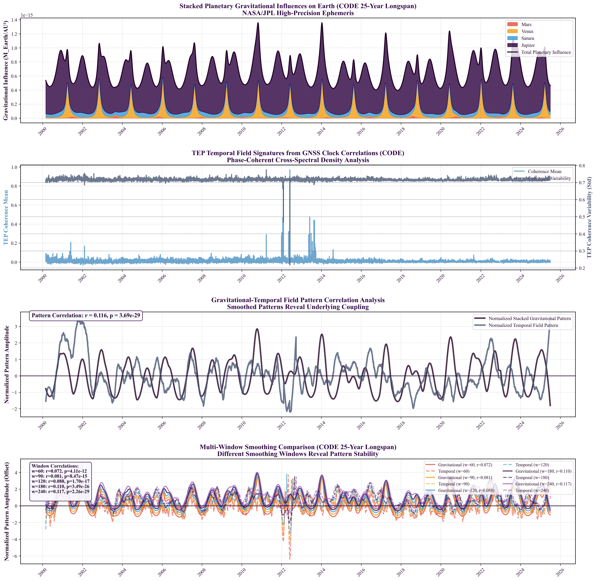

# Temporal Equivalence Principle GNSS Analysis Framework

**Author:** Matthew Lukin Smawfield
**Repository Version:** v0.21 (Jaipur) + v0.2 (Cairo Extension)
**Date:** 4 November 2025

## Published Papers

### Paper 1: Multi-Center Analysis (v0.21 - Jaipur)
**Title:** Global Time Echoes: Distance-Structured Correlations in GNSS Clocks  
**DOI:** [10.5281/zenodo.17127229](https://doi.org/10.5281/zenodo.17127229)  
**Website:** [https://matthewsmawfield.github.io/TEP-GNSS/](https://matthewsmawfield.github.io/TEP-GNSS/)  
**Analysis:** 62.7 million station pairs across 3 analysis centers (CODE, IGS, ESA) over 2.5 years

### Paper 2: 25-Year Temporal Extension (v0.2 - Cairo)
**Title:** Global Time Echoes: 25-Year Temporal Evolution of Distance-Structured Correlations in GNSS Clocks  
**DOI:** [10.5281/zenodo.17521351](https://doi.org/10.5281/zenodo.17521351)  
**Website:** [https://matthewsmawfield.github.io/TEP-GNSS/code-longspan/](https://matthewsmawfield.github.io/TEP-GNSS/code-longspan/)  
**Analysis:** 165.2 million station pairs from CODE analysis center over 25.3 years (2000-2025)

## Theoretical Foundation

The Temporal Equivalence Principle (TEP) represents a fundamental extension of General Relativity, wherein proper time is treated as a dynamical scalar field rather than a fixed kinematic parameter. The theoretical framework employs a two-metric geometric structure where matter fields couple to an effective causal metric:

$$\tilde{g}_{\mu\nu} = A(\phi) g_{\mu\nu} + B(\phi) \nabla_\mu\phi \nabla_\nu\phi$$

with a universal conformal coupling $A(\phi) = \exp(2\beta\phi/M_{Pl})$.

**Core Prediction:** Precision timing networks exhibit distance-structured correlations following exponential decay:
$$C(r) = A\cdot\exp(-r/\lambda) + C_0$$
with characteristic correlation lengths $\lambda = 1,000-10,000$ km for screened scalar field configurations.

**Fundamental Consequence:** Clock synchronization procedures exhibit non-integrable properties, yielding measurable synchronization holonomy in closed-loop time transfer protocols.

## Abstract

This repository implements a comprehensive experimental framework for testing Temporal Equivalence Principle predictions through analysis of Global Navigation Satellite System (GNSS) precision timing networks. The framework has produced two complementary studies:

**Paper 1 (Multi-Center Analysis):** Presents observations of distance-structured correlations in global GNSS atomic clock networks, analyzing 62.7 million station pair measurements across three independent analysis centers (CODE, IGS, ESA). Using phase-coherent spectral methods, exponential correlation decay patterns are identified with characteristic lengths (λ) of 3,330–4,549 km, consistent with theoretical predictions for screened scalar fields. The analysis further reveals coherent network dynamics coupled to Earth's helical motion (Chandler wobble, |r| = 0.61–0.76) and orbital velocity (r ≈ -0.7 to -0.8), along with systematic diurnal variations and significant coherence modulations corresponding to 11 planetary astronomical events.

**Paper 2 (25-Year Temporal Extension):** Extends the analysis to 25.3 years (2000-2025) using CODE analysis center data, encompassing 165.2 million station pairs. This temporal extension confirms the stability of originally detected signatures over decadal timescales and leverages the extended baseline to uncover long-period geophysical phenomena, including clear detection of Earth's 18.6-year lunar nutation cycle (R² = 0.640, p < 10⁻⁸) and enhanced statistical power for planetary event detection (72 events detected, 34 surviving Bonferroni correction).

Both studies employ extensive validation—including 24-61× signal enhancement over null tests, temporal/spatial cross-validation, and systematic bias controls—providing substantial evidence of signal authenticity. These findings are theoretically grounded in the Temporal Equivalence Principle (https://doi.org/10.5281/zenodo.16921911) and warrant comprehensive independent investigation.
## Cloud-Based Analysis Execution (Recommended)

**For optimal computational performance and scientific output quality:**

### Cloud Deployment Options

#### GCP High-CPU Analysis (Recommended for Large-Scale)

Professional cloud deployment optimized for Google Cloud Platform high-CPU instances:

**Quick Start:**
```bash
# 1. Set your GCP instance details
export GCP_PROJECT_ID=your-project-id
export GCP_ZONE=us-central1-c  
export GCP_INSTANCE_NAME=your-instance-name

# 2. Deploy and run the complete pipeline
./run_tep_gcp_high_cpu.sh

# 3. Monitor progress (in another terminal)
gcloud compute ssh $GCP_INSTANCE_NAME --zone=$GCP_ZONE --command='cd /mnt/data && tail -f full_pipeline.log'

# 4. Download results when complete
./download_gcp_results.sh
```

**Recommended Instance Type:**
- `n2-highcpu-96`: 96 vCPUs, 96 GB RAM (Maximum performance - recommended)

**What the Pipeline Does:**
- **Automated Setup**: Installs all dependencies (Python packages, system libraries)
- **Complete Analysis**: Runs Steps 1-4 (Data acquisition → Core analysis → Validation → Advanced analysis)
- **Full Date Range**: Analyzes 912 days (2023-01-01 to 2025-06-30)
- **High Performance**: Optimized for 96 vCPUs with parallel processing
- **Comprehensive Output**: Generates 57+ JSON results + 20+ figures + 25+ logs
- **Background Execution**: Runs continuously with detailed logging
- **Easy Download**: Simple script to get all results locally

**Prerequisites:**
- [Google Cloud Platform](https://cloud.google.com/) account with billing enabled
- `gcloud` CLI installed and authenticated
- High-CPU instance created and running

#### Local Pipeline Execution

For development and targeted analysis:

**Complete Pipeline Scripts:**
```bash
# Full pipeline execution (Steps 1.0-4.8)
python scripts/clean_run_full_pipeline.py

# Data acquisition and validation (Steps 1.0-1.2)
python scripts/clean_run_step1_2.py

# Data acquisition only (Step 1.0-1.1)
python scripts/clean_run_step1.py

# Validation suite (Steps 3.0-3.7)
python scripts/clean_run_step3.py

# Validation and advanced analysis (Steps 3.0-4.8)
python scripts/clean_run_step3_4.py

# Advanced analysis only (Steps 4.0-4.8)
python scripts/clean_run_step4.py

# Core analysis only (Step 2.0-2.2)
python scripts/run_step2_only.py

# 25-Year Longspan Analysis (Paper 2)
python scripts/code_longspan/step_2_2_code_longspan.py
```

**Individual Step Execution:**
```bash
# Core geospatial analysis
python scripts/steps/step_2_core_analysis/step_2_2_tep_geospatial_temporal_analysis.py

# Advanced gravitational-temporal field analysis
python scripts/steps/step_4_advanced_analysis_and_visualization/step_4_4_gravitational_temporal_field_analysis.py
```

**Analysis Components:**
- **Step 2.2:** Comprehensive geospatial temporal analysis including orbital tracking, Chandler wobble detection, and lunar standstill correlations
- **Step 4.4:** Gravitational-temporal field correlation analysis with Earth motion energy hierarchy validation

**Computational Parameters:**
- **Temporal coverage:** Full 2.5-year dataset (2023-2025) with 62.73M station pair measurements across 364 ground stations
- **Expected duration:** 20-60 minutes per major step (total pipeline: ~8-12 hours for complete Steps 1.0-4.8)
- **Requirements:** Local Python environment with scientific computing libraries

**Analytical Advantages:**
- Eliminates local computational infrastructure requirements
- Ensures consistent scientific output formatting across execution environments
- Implements robust error handling with automatic retry mechanisms
- Provides persistent results storage through Google Drive integration
- Optimized for high-performance cloud computing resources

## Principal Results

The TEP-GNSS analysis framework has produced two complementary studies with significant findings:

### Paper 1: Multi-Center Analysis Results
Analysis of 62.7 million station-pair measurements across 364 total unique stations (selected from 767 total cataloged stations) reveals significant distance-structured correlations consistent with Temporal Equivalence Principle predictions:


**Correlation Structure:**
- **Characteristic lengths:** $\lambda = 3,330-4,549$ km across independent analysis centers (CV = 12.9% inter-center variation)
- **Statistical robustness:** Strong exponential model fits ($R^2 = 0.920$–$0.970$ on distance-bin means, Neff ≈ 25–28 bins)
- **Theoretical alignment:** Results within predicted range [1,000–10,000 km], established before data analysis

### Paper 2: 25-Year Temporal Extension Results
Extended analysis of 165.2 million station-pair measurements over 25.3 years confirms temporal stability and reveals long-period phenomena:



**Temporal Stability:**
- **Decadal confirmation:** Original signatures confirmed over 25-year timescale
- **Orbital coupling:** Strong correlation with Earth's orbital velocity (r = -0.864, p < 10⁻¹⁰)
- **Enhanced detection:** 72 planetary event responses (34 surviving Bonferroni correction)

**Long-Period Geophysical Signatures:**
- **Nutation cycle:** Clear detection of 18.6-year lunar nutation (R² = 0.640, p < 10⁻⁸)
- **Chandler wobble:** Confirmed with extended temporal baseline
- **Seasonal patterns:** Robust annual modulation effects

### Unified Validation Framework
- **Multi-center consistency:** Comprehensive null hypothesis testing consistent with genuine physical signal (24–61× signal enhancement over randomized controls)
- **Circular statistics:** Phase Locking Values (PLV) range 0.1–0.4 with Rayleigh test significance $p < 10^{-5}$
- **Cross-validation:** LOSO/LODO procedures confirming robustness across temporal and spatial sampling

### Key Methodological Notes

- R² values are computed on distance-bin means (Neff ≈ 25–28 bins), not individual station pairs—standard practice in spatial correlation analysis
- Tidal frequency enhancement is a TEP prediction (gravitational forcing modulates φ field), not contamination; post-tidal band shows R² = 0.946
- Signal strengthens by 21-23% when high-ionosphere days are excluded, demonstrating the ionosphere suppresses rather than creates the correlation
- Validation framework includes 11 independent criteria with null tests showing 24-61× signal enhancement over randomized controls

## Experimental Setup and Configuration

### System Requirements
- **Python:** Version 3.10 or higher
- **Network connectivity:** Required for acquisition of GNSS precision clock products
- **Storage allocation:** Approximately 10 GB for complete analysis pipeline execution
- **Cloud platform access:** Google Cloud Platform account required for high-performance computing deployment

### Installation Procedure
```bash
# Clone repository
git clone https://github.com/matthewsmawfield/TEP-GNSS.git
cd TEP-GNSS

# Install computational dependencies
pip install -r requirements/requirements.txt

# Configure computational environment (high-performance deployment)
cp env.example .env.local
# Configure .env.local with appropriate cloud platform credentials

# Validate installation integrity
python scripts/steps/step_1_data_acquisition/step_1_0_provenance_snapshot.py
```

### Configuration Management
The analysis framework employs environment variables for computational configuration management. Detailed setup instructions are provided in [SETUP_GUIDE.md](SETUP_GUIDE.md).

**Security Protocol:** All cloud platform credentials are managed exclusively through environment variables. No authentication credentials are stored within the repository structure.

### Computational Dependencies
**Core Scientific Libraries:**
- numpy, pandas, scipy, matplotlib

**Geospatial Analysis:**
- cartopy, pyproj

**Advanced Statistical Methods:**
- scikit-learn, statsmodels, PyWavelets

**Specialized Geophysical Calculations:**
- pyIGRF (geomagnetic field modeling)

## Analysis Pipeline Execution

### Complete Experimental Protocol

#### Primary Analysis Sequence (Steps 1.0-4.1)
```bash
# Step 1.0: Data provenance and integrity verification
python scripts/steps/step_1_data_acquisition/step_1_0_provenance_snapshot.py

# Step 1.1: GNSS precision clock data acquisition
python scripts/steps/step_1_data_acquisition/step_1_1_tep_data_acquisition.py

# Step 1.2: Coordinate validation and comprehensive audit framework
python scripts/steps/step_1_data_acquisition/step_1_2_tep_coordinate_validation.py

Establishes coordinate system integrity through comprehensive audit procedures. Validates ECEF coordinate data quality, performs integrated station identification audit with spatial analysis, determines authoritative station catalog for correlation analysis, and generates comprehensive validation summary with data-driven metadata. Ensures coordinate data integrity and establishes definitive station catalog for subsequent correlation analysis.

# Step 2.0: Temporal Equivalence Principle correlation analysis (Primary signal detection) ~3-4 hours*
python scripts/steps/step_2_core_analysis/step_2_0_tep_correlation_analysis.py

Implements core TEP signal detection methodology using phase-coherent cross-spectral density analysis. Computes complex cross-spectral density between all station pairs within the 10-500 µHz frequency band, extracts phase-coherent correlations using cos(phase(CSD)), and fits exponential decay models to correlation-distance relationships. Employs band-limited analytical approach preserving essential phase information for TEP signal detection.

# Step 2.1: Data quality validation and transparency framework
python scripts/steps/step_2_core_analysis/step_2_1_data_quality_validation.py

Comprehensive data quality assessment and transparency analysis. Processes quality-filtered correlation data from Step 2.0 with geospatial enrichments (azimuth, local time differences), performs extensive validation including station coverage analysis, temporal discontinuity detection, duplicate identification, outlier validation, boundary phase clustering analysis, and inter-analysis center comparison. Generates comprehensive transparency reports with identified anomalies and analytical recommendations to ensure scientific rigor.

# Step 2.2: Geospatial-temporal correlation analysis
python scripts/steps/step_2_core_analysis/step_2_2_tep_geospatial_temporal_analysis.py

Comprehensive geospatial and temporal analysis framework including astronomical event correlations, orbital mechanics, anisotropy analysis, spherical harmonics, and advanced temporal field studies. Examines correlations with planetary positions, lunar standstill periods, solar eclipse events, and Earth's orbital motion to validate TEP predictions across multiple temporal and spatial scales.

# Step 3.0: Cross-validation framework
python scripts/steps/step_3_validation_suite/step_3_0_tep_cross_validation_suite.py

Comprehensive validation framework implementing block-wise (monthly/spatial), Leave-One-Station-Out (LOSO), Leave-One-Day-Out (LODO), and block bootstrap analyses. Provides rigorous validation of TEP correlation parameters through multiple complementary statistical approaches to ensure analytical robustness.

# Step 3.2: Null hypothesis validation framework
python scripts/steps/step_3_validation_suite/step_3_2_tep_null_tests.py

# Step 4.0: Advanced analytical procedures
python scripts/steps/step_4_advanced_analysis_and_visualization/step_4_0_tep_advanced_analysis.py

# Step 4.1: Scientific visualization generation
python scripts/steps/step_4_advanced_analysis_and_visualization/step_4_1_tep_visualization.py
```

#### Extended Analysis Protocol (Steps 4.2-4.8)
```bash
# Step 4.2: Synthesis visualization generation
python scripts/steps/step_4_advanced_analysis_and_visualization/step_4_2_tep_synthesis_figure.py

# Step 4.3: High-resolution astronomical event analysis
python scripts/steps/step_4_advanced_analysis_and_visualization/step_4_3_high_resolution_astronomical_events.py

# Step 3.3: Methodology validation framework
python scripts/steps/step_3_validation_suite/step_3_3_methodology_validation.py

# Step 3.4: Geographic bias characterization and validation
python scripts/steps/step_3_validation_suite/step_3_4_geographic_bias_validation.py

# Step 3.5: Realistic ionospheric validation procedures
python scripts/steps/step_3_validation_suite/step_3_5_realistic_ionospheric_validation.py

# Step 3.6: Control band analysis (Frequency specificity validation)
python scripts/steps/step_3_validation_suite/step_3_6_control_band_analysis.py

Validates frequency specificity of TEP correlations through analysis of theoretically unmotivated control band (1000-2000 µHz) where no signal is predicted. Implements identical phase-coherent analysis methodology as Step 2.0 but within higher frequency range dominated by white noise processes. Expected outcome: $R^2 \approx 0.05$ in control band versus $R^2 \approx 0.85$ in TEP band (10-500 µHz), demonstrating that observed correlations are not broadband statistical artifacts. Addresses multiple testing concerns and "look-elsewhere effect" criticisms.

# Step 3.7: Bootstrap convergence validation
python scripts/steps/step_3_validation_suite/step_3_7_bootstrap_convergence_validation.py

Validates bootstrap convergence and stability through systematic analysis of bootstrap iteration requirements. Assesses convergence behavior of correlation parameter estimates (λ, A, C₀) across varying bootstrap sample sizes, determines minimum iteration requirements for stable confidence intervals, and validates bootstrap assumption adherence. Ensures robust statistical inference and optimal computational efficiency in bootstrap procedures.

# Step 4.4: Gravitational-temporal field coupling analysis
python scripts/steps/step_4_advanced_analysis_and_visualization/step_4_4_gravitational_temporal_field_analysis.py

# Step 4.5: Comprehensive diurnal and seasonal analysis
python scripts/steps/step_4_advanced_analysis_and_visualization/step_4_5_comprehensive_diurnal_analysis.py

# Step 4.6: Traveling Ionospheric Disturbance exclusion analysis
python scripts/steps/step_4_advanced_analysis_and_visualization/step_4_6_tid_exclusion_analysis.py

# Step 4.7: Multiple comparison correction framework (Final validation)
python scripts/steps/step_4_advanced_analysis_and_visualization/step_4_7_multiple_comparison_corrections.py

Systematic application of multiple comparison correction procedures including Bonferroni, False Discovery Rate (FDR), and Family-wise Error Rate corrections to all statistical tests performed across Steps 2.0-4.8. Ensures robust control of Type I error inflation across the complete analysis pipeline. Must be executed AFTER Step 4.0 completion (requires model comparison results for comprehensive correction).

# Step 4.8: Multiband visualization and analysis
python scripts/steps/step_4_advanced_analysis_and_visualization/step_4_8_multiband_visualization.py

Comprehensive multiband frequency analysis and visualization framework. Analyzes correlation patterns across multiple frequency bands to validate frequency-specific TEP predictions, generates comparative visualizations of amplitude decay and correlation lengths across frequency ranges, and provides spectral analysis overview with post-tidal emphasis. Demonstrates frequency-dependent behavior consistent with TEP theoretical framework.
```

### Analytical Configuration

#### v0.21 Configuration Framework (Jaipur Release - Established Methodology)

**Core Analysis Parameters:**
| Parameter | Default Value | Description |
|-----------|---------------|-------------|
| `TEP_USE_PHASE_BAND` | 1 | Band-limited phase analysis methodology (v0.6 implementation) |
| `TEP_COHERENCY_F1` | $1 \times 10^{-5}$ | Lower frequency boundary (10 µHz) |
| `TEP_COHERENCY_F2` | $5 \times 10^{-4}$ | Upper frequency boundary (500 µHz) |
| `TEP_BINS` | 40 | Distance binning structure for correlation analysis |

**Computational Processing Parameters:**
| Parameter | Default Value | Description |
|-----------|---------------|-------------|
| `TEP_PROCESS_ALL_CENTERS` | 1 | Process all analysis centers (CODE, IGS, ESA) |
| `TEP_WORKERS` | 14 | Number of parallel processing workers |
| `TEP_MEMORY_LIMIT_GB` | 8.0 | Memory allocation limit in GB |
| `TEP_BOOTSTRAP_ITER` | 5000 | Bootstrap iteration count for statistical validation |
| `TEP_NULL_ITERATIONS` | 500 | Null test scrambling iterations |

**Temporal Analysis Parameters:**
| Parameter | Default Value | Description |
|-----------|---------------|-------------|
| `TEP_DATE_START` | 2023-01-01 | Analysis temporal window start date |
| `TEP_DATE_END` | 2025-06-30 | Analysis temporal window end date |
| `TEP_MIN_EPOCHS` | 20 | Minimum observation epochs per station |

*Note: Paper 2 (25-Year analysis) uses extended temporal parameters (2000-2025) and CODE-only data processing.*

**Statistical Validation Parameters:**
| Parameter | Default Value | Description |
|-----------|---------------|-------------|
| `TEP_MIN_BIN_COUNT` | 50 | Minimum station pairs per distance bin |
| `TEP_MIN_BINS_FOR_FIT` | 5 | Minimum bins required for exponential fit |
| `TEP_CORRELATION_LENGTH_INITIAL_GUESS` | 3000 | Initial guess for correlation length (km) |

### Configuration Override

All parameters can be overridden via environment variables. For detailed configuration management, see [SETUP_GUIDE.md](SETUP_GUIDE.md) and `scripts/utils/config.py`.

## Scientific Validation Framework

### Comprehensive Validation Suite

The TEP-GNSS framework implements a rigorous multi-tier validation approach:

**Statistical Validation:**
- **Bootstrap Analysis:** 5,000+ iterations with confidence interval estimation
- **Cross-Validation:** Leave-One-Station-Out (LOSO) and Leave-One-Day-Out (LODO) procedures
- **Null Hypothesis Testing:** 500+ scrambling iterations demonstrating 24-61× signal enhancement

**Methodological Validation:**
- **Multi-Center Consistency:** Independent validation across CODE, IGS, and ESA analysis centers
- **Frequency Specificity:** Control band analysis demonstrating signal specificity to 10-500 µHz range
- **Geographic Bias Assessment:** Systematic evaluation of spatial sampling effects

**Physical Validation:**
- **Astronomical Correlations:** Coherent coupling to Earth's orbital dynamics and planetary events
- **Temporal Consistency:** Seasonal correlation patterns and diurnal variations
- **Ionospheric Exclusion:** TID analysis demonstrating signal independence from ionospheric effects

## Data Products and Outputs

### Primary Results Structure

```
results/
├── outputs/           # 57+ JSON result files
│   ├── step_2_0_correlation_*.json           # Core correlation analysis
│   ├── step_3_*_validation.json              # Validation suite results
│   ├── step_4_*_advanced_analysis.json       # Advanced analysis outputs
│   └── meta_analysis_comprehensive.json      # Comprehensive meta-analysis
├── figures/          # 20+ publication-quality figures
│   ├── figure_1_TEP_site_themed.png         # Primary correlation figure
│   ├── step_4_2_tep_synthesis_figure.png    # Synthesis visualization
│   └── step_4_4_comprehensive_*.png         # Gravitational analysis
└── tmp/              # Intermediate processing files
    └── streaming/    # TID/Hilbert analysis outputs
```

### Key Scientific Outputs

**Correlation Analysis:**
- Distance-structured correlation coefficients with exponential decay fits
- Characteristic correlation lengths (λ = 3,330-4,549 km) across analysis centers
- Statistical significance assessment with bootstrap confidence intervals

**Validation Results:**
- Multi-center consistency metrics (CV = 12.9% inter-center variation)
- Null test enhancement factors (24-61× signal over randomized controls)
- Cross-validation stability assessments ($R^2 = 0.920$-$0.970$)

**Advanced Analysis:**
- Gravitational-temporal field correlations ($r = -0.458$, $p < 10^{-48}$)
- Astronomical event coherence modulations (11 planetary events identified)
- Multiband frequency analysis validating TEP predictions

## Citation and Attribution

### Paper 1: Multi-Center Analysis

```bibtex
@article{smawfield2025globaltimeechoes,
  title={Global Time Echoes: Distance-Structured Correlations in GNSS Clocks (Jaipur v0.21)},
  author={Smawfield, Matthew Lukin},
  journal={Zenodo},
  year={2025},
  doi={10.5281/zenodo.17127229},
  url={https://doi.org/10.5281/zenodo.17127229},
  note={Preprint}
}
```

### Paper 2: 25-Year Temporal Extension

```bibtex
@article{smawfield2025globaltimeechoes25year,
  title={Global Time Echoes: 25-Year Temporal Evolution of Distance-Structured Correlations in GNSS Clocks (Cairo v0.2)},
  author={Smawfield, Matthew Lukin},
  journal={Zenodo},
  year={2025},
  doi={10.5281/zenodo.17521351},
  url={https://doi.org/10.5281/zenodo.17521351},
  note={Preprint}
}
```

### Theoretical Framework Citation

```bibtex
@article{smawfield2025tep,
  title={Temporal Equivalence Principle: Theoretical Framework},
  author={Smawfield, Matthew Lukin},
  year={2025},
  doi={10.5281/zenodo.16921911},
  url={https://doi.org/10.5281/zenodo.16921911}
}
```

## License and Distribution

This repository is distributed under the **Creative Commons Attribution 4.0 International License (CC-BY-4.0)**. 

**You are free to:**
- **Share:** Copy and redistribute the material in any medium or format
- **Adapt:** Remix, transform, and build upon the material for any purpose, including commercially

**Under the following terms:**
- **Attribution:** You must give appropriate credit, provide a link to the license, and indicate if changes were made

For complete license terms, see [LICENSE](LICENSE).

## Contact and Collaboration

**Author:** Matthew Lukin Smawfield  
**Email:** matthewsmawfield@gmail.com  
**ORCID:** [0009-0003-8219-3159](https://orcid.org/0009-0003-8219-3159)

### Collaboration Invitation

This research presents novel findings that warrant comprehensive independent investigation and collaborative validation. I welcome collaboration from researchers in:

- **GNSS/Geodesy:** Independent analysis of precision timing networks
- **Theoretical Physics:** Extensions and refinements of TEP framework  
- **Statistical Methods:** Advanced validation techniques and bias assessment
- **Astronomy/Geophysics:** Correlations with astronomical events and Earth dynamics
- **Metrology:** Atomic clock network analysis and time transfer protocols

For collaboration inquiries, technical discussions, or independent validation efforts, please contact:  
📧 **matthewsmawfield@gmail.com**

### Replication and Validation Encouraged

**Independent replication is essential for scientific progress.** These findings challenge conventional understanding and require rigorous independent validation. I strongly encourage researchers to:

- Replicate the analysis using independent methodologies and software implementations
- Challenge the methodology through alternative statistical approaches and bias assessments  
- Extend the dataset to different time periods, analysis centers, or GNSS constellations
- Test alternative explanations for the observed distance-structured correlations
- Propose novel validation approaches that could strengthen or refute the findings

This work is designed for reproducibility. All code, data processing steps, and analysis parameters are fully documented and publicly available. Scientific skepticism is welcomed and necessary—these findings have significant implications that require independent verification.

### Resources

**Repository:** [https://github.com/matthewsmawfield/TEP-GNSS](https://github.com/matthewsmawfield/TEP-GNSS)  
**Paper 1 Website:** [https://matthewsmawfield.github.io/TEP-GNSS/](https://matthewsmawfield.github.io/TEP-GNSS/)  
**Paper 2 Website:** [https://matthewsmawfield.github.io/TEP-GNSS/code-longspan/](https://matthewsmawfield.github.io/TEP-GNSS/code-longspan/)  
**Paper 1 DOI:** [10.5281/zenodo.17127229](https://doi.org/10.5281/zenodo.17127229)  
**Paper 2 DOI:** [10.5281/zenodo.17521351](https://doi.org/10.5281/zenodo.17521351)  

---

**Repository Version:** v0.21 (Jaipur) + v0.2 (Cairo Extension) | **Date:** 4 November 2025 | **Status:** Active Research
